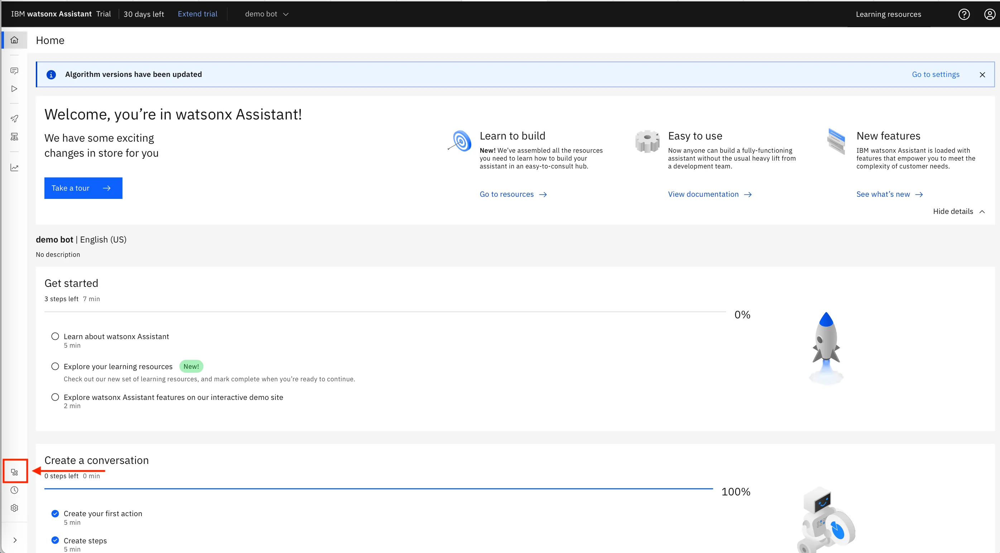
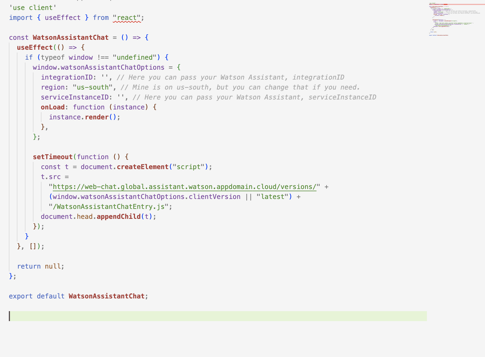
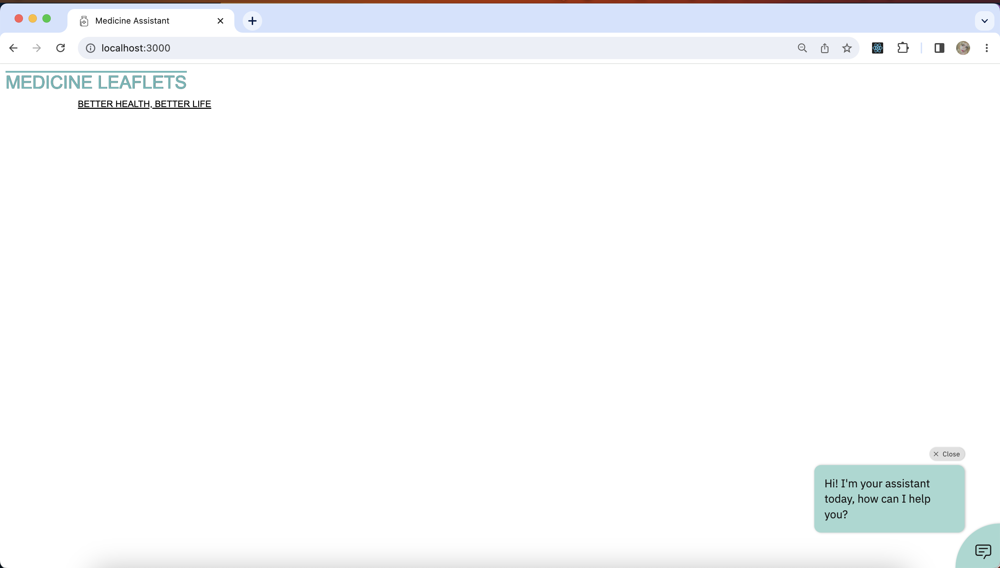
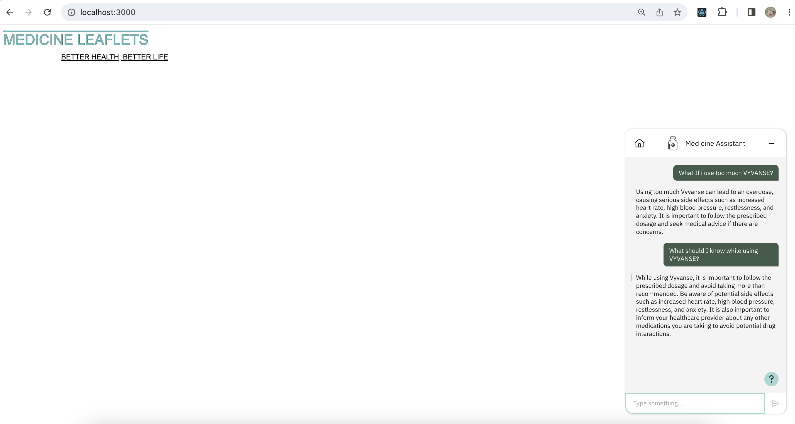

**This is a simple web page integrated with Watson Assistant V2 (IBM) made with TypeScript**

```I've create this for the purpose of study. This project doesn't include my knowledge base that I used in Watson Discovery, nor an OpenAPI for use with NeuralSeek and nor the skills that i made with Watsox Assistant.```

## To integrate your Assistant from Watsonx Assistant on your webpage

The integration of **Watson Discovery** and **NeuralSeek** is in **Watson Assistant**, so it's simple to integrate with your web page and this was an example of that. The **Watson Assistant** provides the script to integrate to your code.

**To integrate Assistant on your webpage, open your Watsonx Assistant instance on IBM Cloud:**

Click on the icon on the left side menu as the imagem below:



Now click on Open on the Web chat section


Navegate to the `Embed` section, on this page you should have all the code to integrate your Watsonx Assistant on your page.

The code is ready to copy and paste into your application. 


On this example i've use Typescript so i had to do some changes to it, i did this integration on the file that is located in: `medicine-assistant/src/app/Components/WatsonAssistantChat.tsx` 

-> None of my credentials are available in this file



### About this project

I made this **Assistant** to provide answers about some medicines. I use **Watson Assistant**, **Watson Discovery** and **NeuralSeek** all of them are available on **IBM Cloud**.

**Watson Assistant:** To build a virtual agent, powered by AI

**Watson Discovery**: To search and answer questions about business documents using custom NLP and Large Language Models from IBM Research.

**NeuralSeek:** Connects existing knowledge database (in my case was Discovery) and instantly generates natural-language answers to real customer questions.


In these examples below, I'm Asking Watson Assistant about Vyvanse and then got an answer based on my the data that i provided. 



In these examples below, I'm Asking Watson Assistant about Vyvanse and then got an answer based on my the data that i provided. 




### To run projects like this

Get the project and then install all dependences:

`yarn`

Run the development server:

`yarn dev`


Open [http://localhost:3000](http://localhost:3000) with your browser to see the result.


## Learn about more the products

Watson Assistant: click [here](https://www.ibm.com/products/watson-assistant).
<br>
<br>
Watson Discovery: click [here](https://www.ibm.com/products/watson-discovery).
<br>
<br>
NeuralSeek: click [here](https://cloud.ibm.com/catalog/services/neuralseek).
