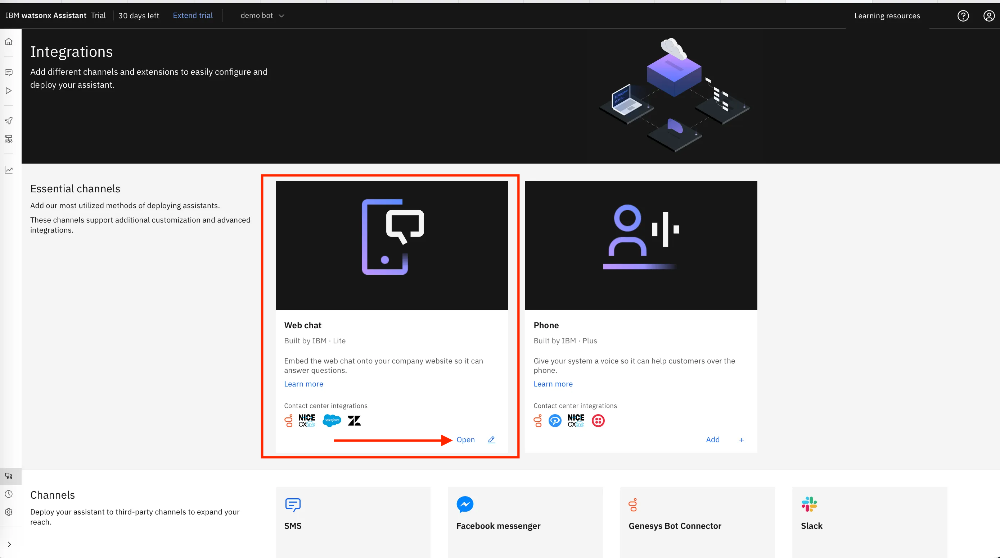
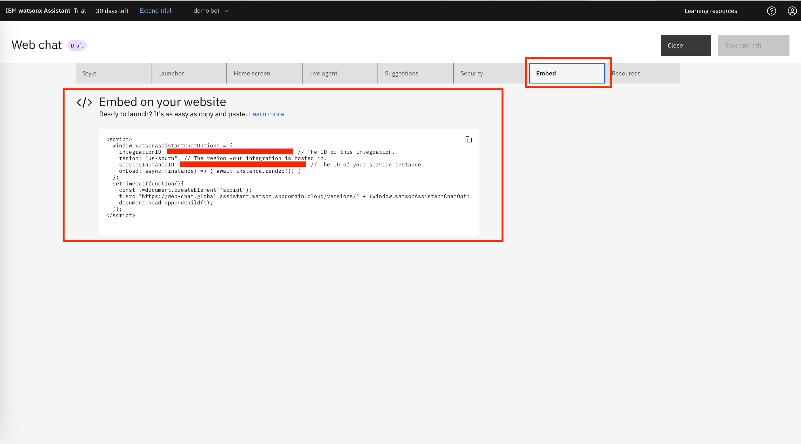

This is a simple web page integrated with Watson Assistant V2 (IBM)

**I created for the purpose of study.**

I made this **Assistant** to provide answers about some medicines. I use **Watson Assistant**, **Watson Discovery** and **NeuralSeek** available on **IBM Cloud**.

**Watson Assistant:** To build a virtual agent, powered by AI

**Watson Discovery**:\*\* To search and answer questions about business documents using custom NLP and Large Language Models from IBM Research.

**NeuralSeek:** Connects existing knowledge database (in my case was Discovery) and instantly generates natural-language answers to real customer questions.

The integration of **Watson Discovery** and **NeuralSeek** is in **Watson Assistant**, so it's simple to integrate with your web page and this was an example of that. The **Watson Assistant** provides the script to integrate to your code.

In these examples below, I'm Asking Watson Assistant about Vyvanse and then got an answer based on my the data that i provided. 

## Getting Started

Get the project and then install all dependences:

`yarn`

Run the development server:

`yarn dev`

Open [http://localhost:3000](http://localhost:3000) with your browser to see the result.

## Learn about more IBM's products.

Watson Assistant: click [here](https://www.ibm.com/products/watson-assistant).
Watson Discovery: click [here](https://www.ibm.com/products/watson-discovery).
NeuralSeek: click [here](https://cloud.ibm.com/catalog/services/neuralseek).
